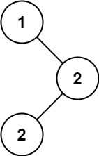

Given the root of a binary search tree (BST) with duplicates, return all the ***mode(s)*** (i.e., the most frequently occurred element) in it.

If the tree has more than one mode, return them in any order.

Assume a BST is defined as follows:

The left subtree of a node contains only nodes with keys less than or equal to the node's key.
The right subtree of a node contains only nodes with keys greater than or equal to the node's key.
Both the left and right subtrees must also be binary search trees.


# Example
```code
Input: root = [1,null,2,2]
Output: [2]
```