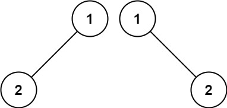

Given the roots of two binary trees p and q, write a function to check if they are the same or not.

Two binary trees are considered the same if they are structurally identical, and the nodes have the same value.

# Example 1

```code
Input: p = [1,2,3], q = [1,2,3]
```
Output: true

# Example 2

```code
Input: p = [1,2], q = [1,null,2]
```
Output: false

```java 
public class Solution {
public boolean isSameTree(TreeNode p,TreeNode q){
    if(p==null&&q==null){
        return true;
    }
    if(p==null||q==null){
        return false;
    }
    if(p.val!=q.val){
        return false;
    }
    return isSameTree(p.left,q.left)&&isSameTree(p.right,q.right);
  }
}
```
# Explanation
1. The condition ***if (p == null && q == null)*** checks whether both pointers p and q are pointing to null. If they are, 
it means both trees are empty, and the function returns true. The time complexity of this step is O(1), and the memory usage is O(1).
2. The condition ***if (p == null || q == null)*** checks whether at least one of the pointers p or q is pointing to null.
If this condition is met, it means one tree ends while the other doesn't, so the function returns false. The time complexity is O(1), and the memory usage is O(1).
3. The condition if (p.val != q.val) checks whether the values of the current nodes in p and q are different. If they are, it means these nodes are different, and the function returns false. The time complexity is O(1), and the memory usage is O(1).
4. The final recursive part return isSameTree(p.left, q.left) && isSameTree(p.right, q.right) compares the left and right subtrees of trees p and q using recursion. For each node, the function compares the values of the nodes and recursively calls itself for the left and right subtrees. The time complexity of this part is O(N), where N is the total number of nodes in the tree (complexity depends on the depth of the tree and the number of nodes). Memory usage depends on the depth of the recursion and can be substantial for deep trees.

# The difference between && (logical "AND") and || (logical "OR") in conditional expressions in English is as follows:

1. ***&&*** is used when both operands must be true for the expression to be true. If at least one of the operands is false, the expression will be false.
2. ***||*** is used when the expression should be true if at least one of the operands is true. That is, if one of the operands is true, the expression will be true.